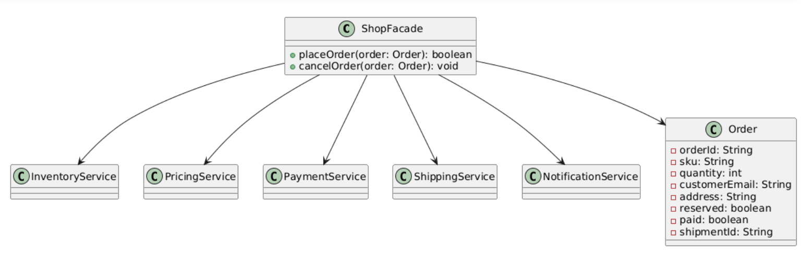

# Facade Pattern — Online Shop Example

This project demonstrates the **Facade** design pattern in Java with a simple online shopping flow.

## Structure

- `ShopFacade` — the **Facade** that exposes a simplified API: `placeOrder(Order)` and `cancelOrder(Order)`.
- Subsystems:
  - `InventoryService` — stock verification & reservation
  - `PricingService` — price calculation
  - `PaymentService` — charge & refund
  - `ShippingService` — shipment creation & cancellation
  - `NotificationService` — email notifications
- `Order` — value object for order details
- `FacadeDemo` — client entry point

## How to run

```bash
javac *.java
java FacadeDemo
```

## PlantUML

